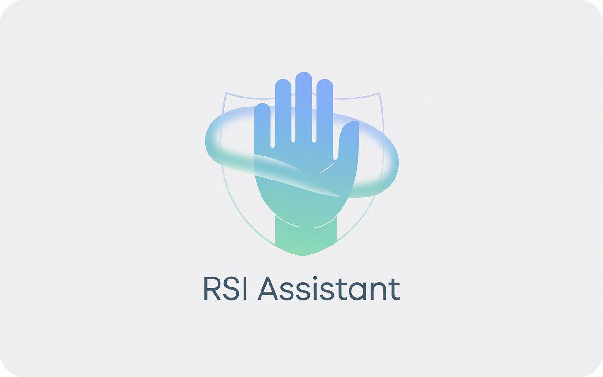

# RSI Recovery Assistant



A native macOS menu bar application designed to help prevent Repetitive Strain Injury (RSI) using smart break timers and idle detection. Built with [Tauri](https://tauri.app), [React](https://react.dev), and [Rust](https://www.rust-lang.org).

## Features

- **Smart Timer System**:
  - **Microbreaks**: Frequent, short pauses to reduce strain.
  - **Rest Breaks**: Longer breaks for accumulated work time.
  - **Daily Limits**: Tracks total active computer usage.
- **Intelligent Idle Detection**: Automatically pauses timers when you are away from the keyboard/mouse.
- **Configurable Settings**: Adjust intervals, durations, and strictness directly from the UI.
- **Native Performance**: Light on system resources, leveraging Rust for the backend.
- **Modern UI**: Clean interface built with React, Tailwind CSS, and shadcn/ui.

## Tech Stack

- **Frontend**: React, TypeScript, Tailwind CSS, shadcn/ui
- **Backend**: Rust, Tauri
- **State Management**: Custom Rust-based `TimerService` with event emission to React
- **Build Tool**: Vite, Bun

## Getting Started

### Prerequisites

- [Node.js](https://nodejs.org/) & [Bun](https://bun.sh/)
- [Rust](https://www.rust-lang.org/tools/install) (latest stable)
- macOS (Development target)

### Installation

1. Clone the repository:

   ```bash
   git clone https://github.com/yourusername/rsi-assistant.git
   cd rsi-assistant
   ```

2. Install frontend dependencies:

   ```bash
   bun install
   ```

3. Run the development environment:

   ```bash
   bun run tauri dev
   ```

## Project Structure

- `src-tauri/`: Rust backend
  - `src/idle/`: Idle detection logic using `device_query`.
  - `src/timer/`: Core timer state machine and configuration.
  - `src/commands.rs`: Tauri commands exposed to the frontend.
- `src/`: React frontend
  - `components/`: UI components (e.g., `TimerDisplay`).
  - `hooks/`: Custom hooks (e.g., `useTimer`).
  - `pages/`: Application views (e.g., `Settings`).

## Architecture

The application uses an event-driven architecture. The Rust backend maintains the authoritative timer state and "ticks" every second. It broadcasts `timer-update` events to the frontend only when state changes or time passes. The frontend is a lightweight view layer that renders this state and sends user commands (like "update settings") back to the Rust core.

For more details, see [docs/architecture.md](docs/architecture.md).

## License

MIT
